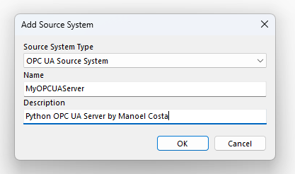
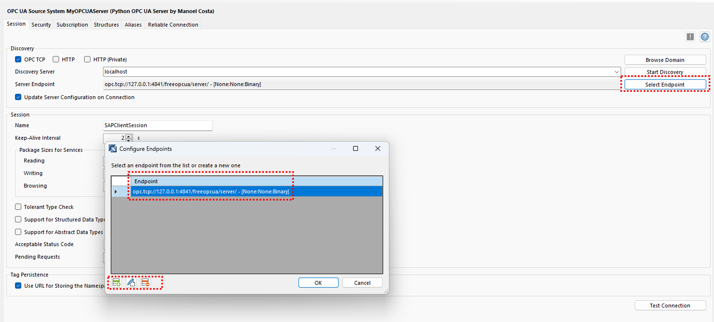
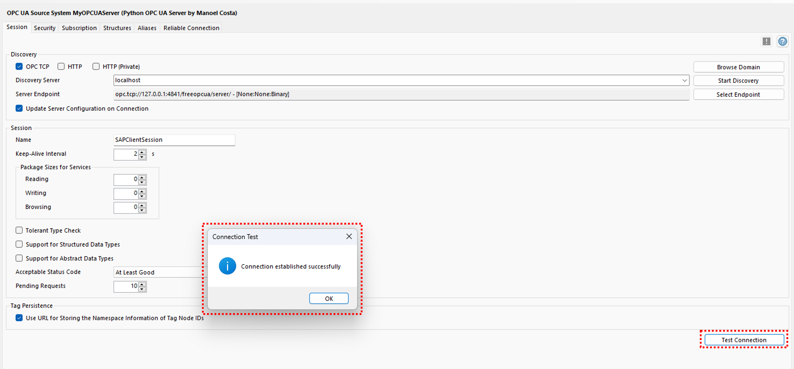
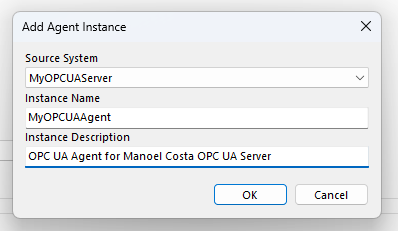
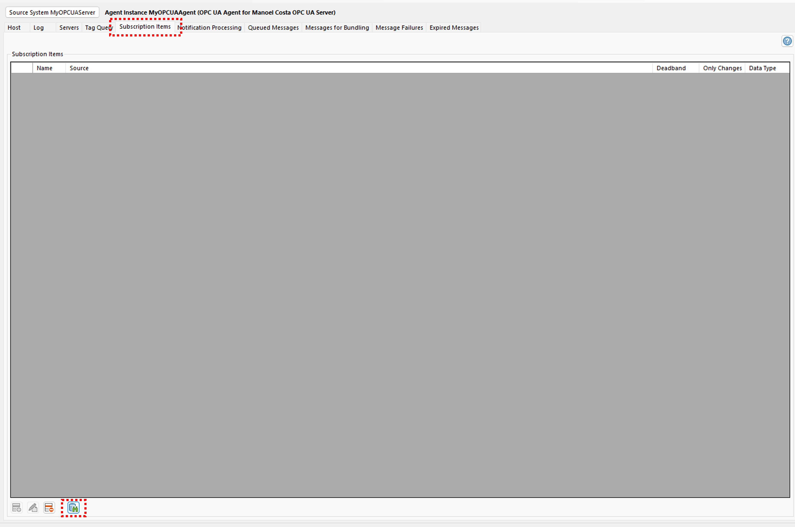
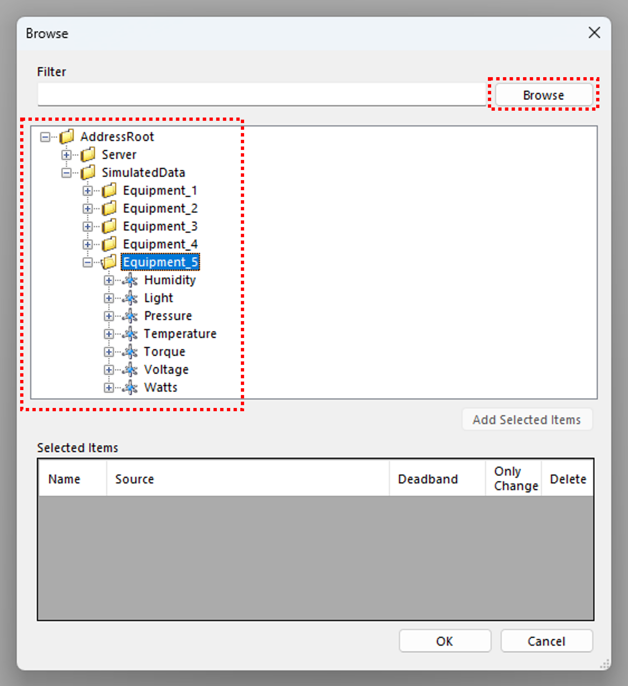

# OPC UA Python Server with Simulated Data

Author: Manoel Costa
Date: 2023-03-29

This project provides an OPC UA server implementation in Python that simulates multiple equipment nodes, each with its own set of tags for temperature, pressure, torque, humidity, light, voltage, and watts. The server continuously updates the tags with random simulated data, which can be useful for testing OPC UA clients, data analysis pipelines, or visualization tools without requiring access to real equipment.

## Prerequisites

- Python 3.6 or higher
- Pip (Python package installer)

## Installation

Clone this repository:
git clone https://github.com/manoelfranklins/my-opcua-python-server.git

Change to the cloned repository directory:
cd my-opcua-python-server

Install the required "opcua" library using pip:
pip install opcua

Running the Server
Review the opcua_server.py script to ensure the server endpoint, namespace, and other settings match your requirements.

Run the server script:
python opcua_server.py

The OPC UA server will start and listen for connections on the configured endpoint.

## Usage

Use an OPC UA client to connect to the server using the configured endpoint. For example:
opc.tcp://127.0.0.1:4841/freeopcua/server/

Browse the server's address space to find the "SimulatedData" node, which contains the equipment nodes.

Each equipment node (e.g., "Equipment_1", "Equipment_2", etc.) has its own set of tags for temperature, pressure, torque, humidity, light, voltage, and watts.

Read the values of the tags, which are updated continuously with random simulated data.

Optionally, you can use the OPC UA client to monitor the tags for real-time updates.

## Usage with SAP Plant Connectivity (SAP PCo)

Create a new Source System

Configure OPC UA Endpoint

Test the Connection

Create a new Agent Instance

Open Subscription Itens tab and click Browse Tabs

Click Browse to see all Equipment and Tags

## License
This project is licensed under the MIT License.
